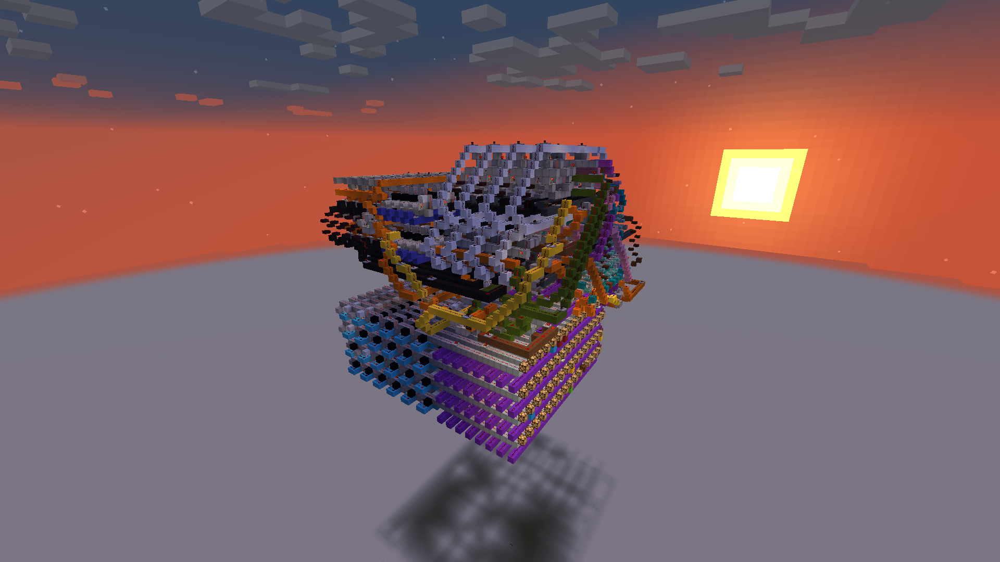

# Redstone computer

A 4-bit solid-state redstone computer. Designed to be fast and compact, while only using basic redstone blocks.



*Appearance of the computer*

## Description

The computer has a 4-bit data word size and an 8-bit program word size. It 16 words of memory and 64 words of program memory. The clock can run at up to 0.58 Hz (17 redstone ticks).

The processor has a single accumulator register. The following describes the instruction set:

```
0010mmmm 		    LD	Load
0011iiii 		    LDI	Load immediate
1101mmmm 		    STR	Store

1000.... 		    NOT	Bitwise not
0110mmmm 		    OR	Bitwise or
0111mmmm 		    AND	Bitwise and
0101.... 		    SHL	Shift left
0100.... 		    SHR	Shift right
0000mmmm 		    ADD	Add with carry
0001mmmm 		    SUB	Subtract with carry
1100mmmm 		    CMP	Compare
1001...i 		    SC	Set carry

1010.... ..pppppp 	JMP	Jump
1110.... ..pppppp 	JLT	Jump if less than
1111.... ..pppppp 	JGT	Jump if greater than
1011.... ..pppppp 	JEQ	Jump if equal


m - RAM address
i - immediate
p - ROM address
. - don't care
```

## Example


*Sped up footage of the computer running*